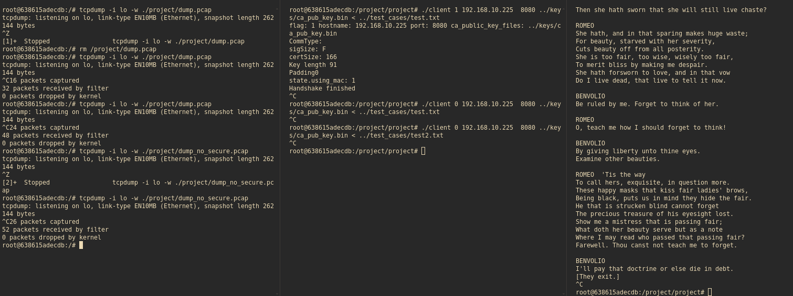
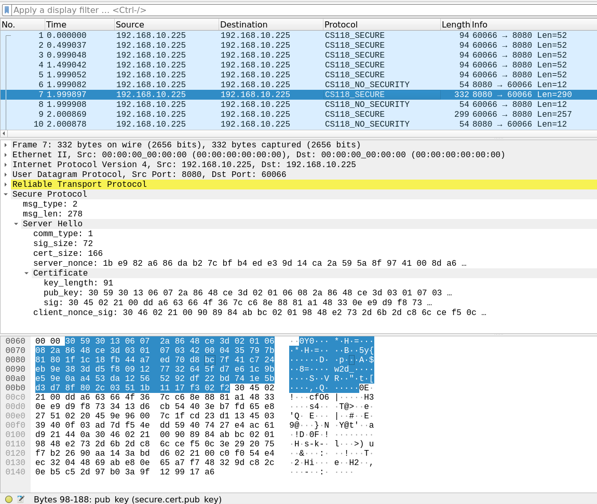

# cs118_packet_dissector
Wireshark Packet Dissector for S24 CS118 Project 2

## (Maybe) FAQ

- Make sure you use port `8080` for your tests
    - Alternatively, you can modify the script on the last line to use a UDP different port

    ```
    udp_port:add(your_port_of_choice, simple_protocol)
    ```
- Why does the dissector say my un-secured communication is secure?
    - The dissector tries to parse all of your packet as secured. If you want to see the raw bytes that un-secured mode uses, go to the `Reliable Transport Protocol` drop-down and look at the `payload_byte` or `payload_str` sections.  
## What is this?

This is a lua script plugin for wireshark that can dissect the packets defined here: https://docs.google.com/document/d/1bf3gbwm4cN_A_xwObk9WteAuUUwTPRh_sRg9g7t0Shc/edit?usp=sharing

## What is this useful for?

- Double checking if your packet fields are correctly aligned/assigned
- Checking if you're sending what you think you're sending to the reference implementation
- Comparing what your field values are to what the reference implementation has

## What is this NOT useful for?

- Inspecting encrypted data (it's not possible without the keys)
- Telling you if your field values are correct
    - The packet dissector can't reason about the validity of your fields; you should think about if it make sense or not
    - The best the dissector can do is crash when some of your values are incorrect.

## How do I install it?

Copy the `.lua` script and paste it into the folder, following the instructions in the "installation" section: https://www.quantulum.co.uk/blog/tldr-wireshark-udp-dissector/

- Open Wireshark
- Open "About Wireshark" dialog
    - On Linux/Windows goto "Help -> About Wireshark"
    - On Mac goto "Wireshark -> About Wireshark"
- Change to "Folders" tab
- Double Click on the entry with the column "Name" `Personal Lua Plugins`
- Copy the script into that folder

If you're not sure which entry of the table it is, go to the link above and scroll to the installation section; the original author has highlighted it.

Type ctrl-shift-l to refresh the lua script after you first copied it. If you need to modify it more in the future, directly edit the `.lua` script and type ctrl-shift-l to refresh it. 

## How do I use it?

### Native

If you can compile the project on your own system, you can run wireshark directly and listen to packets live; filter for `udp.port==8080` or your port of choice, and watch the dissector dissect your packet as they come in!

### Docker

Before you start the client and server, start a new shell into the docker container and enter the following command and leave it running:

```
tcpdump -i lo -w /project/dump.pcap
```

This command tells tcpdump to listen to the loopback interface in our docker container and dump the data to the file `/project/dump.pcap`. You can see the resulting file outside of the docker container in the `project` folder. 

Now you can start your client and server and let them run.



After you're done sending, you can stop the `tcpdump` command. Now outside of the container, the result will be stored in `dump.pcap`, and you can open it using wireshark. 

To open a new file using wireshark:
https://www.wireshark.org/docs/wsug_html_chunked/ChIOOpenSection.html

The resulting UI should look something like this:




### Auto Grader

You can do the same thing in the auto-grader docker container. You'll need to use `tmux` to open multiple terminals. Make sure you output your capture files to a folder mounted from outside the docker container. 


## What are the other pcap files?

I've included some pcap files that I recorded using `tcpdump` on my own implementation.

`dump_no_secure.pcap` is a dump of an input transported with no security.

`dump_secure.pcap` is a dump of an input transported with security.

You'll notice the dissector tries to dissect both as secure; if your payload isn't secure, see the FAQ. 